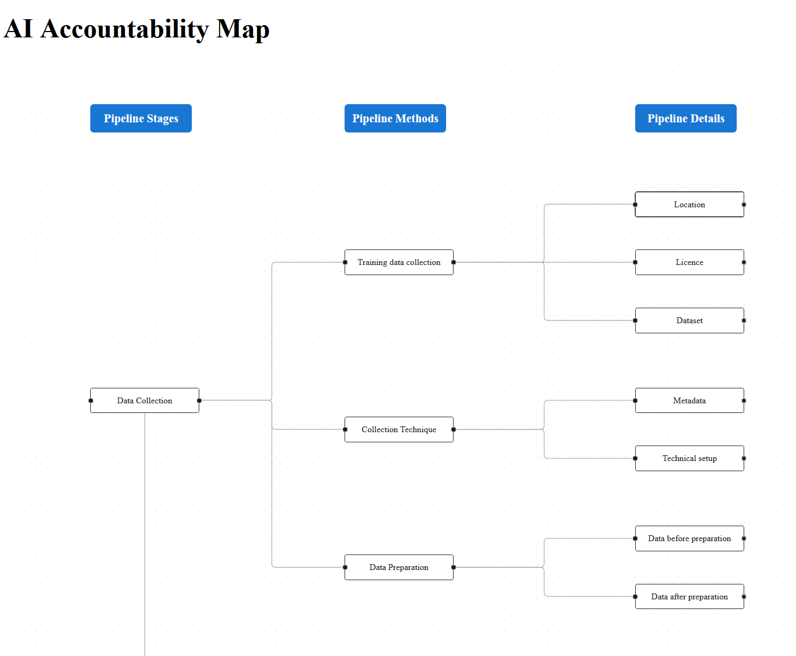

# ⚖️ AI Accountability Map

A traceability and documentation tool for Machine Learning development pipelines. Built to align with principles from the **EU AI Act (2024)**, this platform helps teams visualize, log, and validate each development phase of an ML system using an interactive map, complete with evidence uploads and responsible actor attribution.

---

## 🔍 Preview



---

## 📌 Key Features

- 🌐 **Interactive Accountability Map**  
  Visualize your pipeline in 3 levels:
  - **Pipeline Stages** (EU AI Act): Data Collection, Preprocessing, Development, Deployment
  - **Pipeline Methods**: Specific processes or tools used in each stage
  - **Pipeline Details**: Evidence, logs, responsible actors, metrics, images, files

- 📎 **Evidence Uploads**  
  Upload and attach:
  - `.csv` datasets or results
  - `.png/.jpg` model charts or explainability plots

- 📉 **Model Forecast Logging (Optional)**  
  Input data manually or fetch real-time weather → Predict PV output → Log performance metrics + SHAP plots into the map.

---

## 🧱 Tech Stack

| Layer          | Stack                                    |
|----------------|------------------------------------------|
| **Frontend**   | React, TypeScript, Tailwind CSS, React Flow |
| **Backend**    | FastAPI, SQLAlchemy, PostgreSQL, Pydantic |
| **ML Models**  | LSTM (trained for PV generation forecast) |
| **Explainability** | SHAP (optional integration)           |

---

## 🧾 Versions

- **Node.js:** v18+
- **Python:** 3.10+
- **FastAPI:** 0.110+
- **React:** 18+
- **PostgreSQL:** 14+

---

## 📂 Project Structure

### **Frontend**

```
frontend/
├── components/        # Nodes, Modals, Forms
├── pages/             # HomePage (Map)
├── services/          # API abstraction (Axios)
├── styles/            # TailwindCSS config
├── types/             # TypeScript interfaces
└── App.tsx
```

### **Backend**

```
backend/
├── requirements.txt   # Python dependencies
├── init-db/   # Database File (.sql) 
└── app/
    ├── main.py              # FastAPI app
    ├── database.py          # PostgreSQL setup
    ├── models/              # SQLAlchemy models
    ├── routers/             # API routes
    ├── schemas/             # Pydantic validation
    └── create_tables.py     # Schema init script
```

---

## 🧪 Local Setup (How to Run)

- **Install Docker desktop on you local/virtual machine**
- **Open your CMD/Powershell Terminal**
- **Clone this project repository in any directory of your choice (e.g. documents, desktop)**
- **Give the project folder a suitable name or leave as-is**
- **Navigate to the project folder in your terminal (from your default terminal directory e.g. cd c:\user\Desktop\ai-accountability-map)**
- **The run the following command:**
```bash
docker compose build
docker compose up
```
**Finally open your browser and visit `http://localhost`**
---

## 🔗 API Summary

| Endpoint                                | Description                   |
|-----------------------------------------|-------------------------------|
| `GET /pipeline_stages/`                 | List all pipeline stages      |
| `POST /pipeline_stages/`                | Create a stage                |
| `GET /pipeline_method/`                 | List all methods              |
| `POST /pipeline_method/`                | Create a method               |
| `GET /pipeline_details/by_method/{id}`  | Get details for a method      |
| `POST /pipeline_details/` (file upload) | Add detail with optional file |

---

## 🧠 Use Cases

- 🔬 Research documentation (model tracking)
- 📑 Compliance with AI regulations
- 👥 Role-based responsibility logging
- 📊 Model performance audits and explainability

---

## 📍 Next Steps (Optional Phase 2)

- SHAP explainability visual integration
- Forecasting interface (real-time + dataset)
- Auto-log metrics + input CSV
- Version control for pipeline changes

---

## 📜 License

This project is released under the [MIT License](LICENSE).

---

## 🤝 Contributing

Pull requests are welcome!  
For major changes, please open an issue first to discuss what you’d like to change.

---

## 🧑‍💻 Author

- **Lead Developer / Researcher:** Mubarak Ahmad B.
- **Supervisors:** Prof. Dr.-Ing. Hermann de Meer, Prof. Dr. Florian Lemmerich, Anna Volkova
---

## 📖 References

- [EU AI Act 2024](https://artificialintelligenceact.eu/)
- [FastAPI](https://fastapi.tiangolo.com/)
- [React Flow](https://reactflow.dev/)
- [SHAP Explainability](https://github.com/slundberg/shap)

---

> This platform enables **traceability and transparency** in AI systems from the ground up — linking every decision, dataset, and result to the people and processes behind it.
